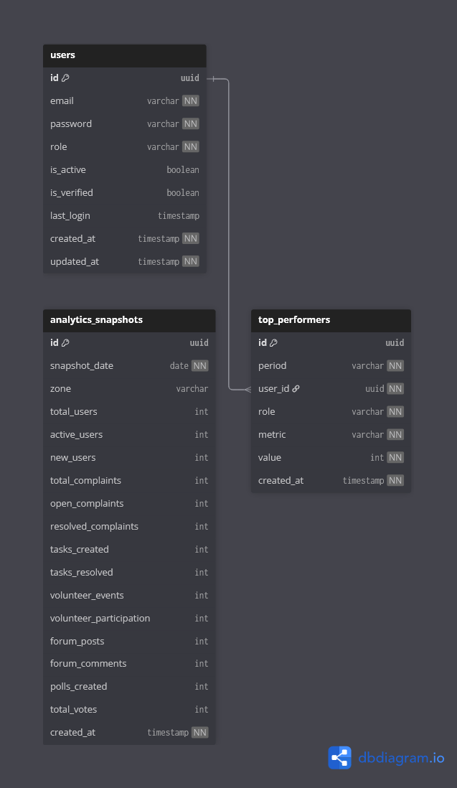

# 📊 Analytics & Insights Context

## Overview

The **Analytics Context** is responsible for generating **system-wide insights, trends, and performance summaries** across the CivicEdge platform.

This context does not participate in live workflows.  
Instead, it consumes data from other contexts and stores **precomputed snapshots** for dashboards, reports, and decision support.

In simple terms, this context answers:

> **What is happening across the platform over time?**

---

## 🎯 Responsibilities

The Analytics Context handles:

- Periodic aggregation of system metrics
- Storage of daily or scheduled snapshots
- Zone-based and global analytics
- Identification of top-performing contributors
- Supplying data for admin dashboards

This context focuses on **observation**, not interaction.

---

## 🧩 Owned Models

| Table | Description |
|------|-------------|
| `analytics_snapshots` | Aggregated platform metrics |
| `top_performers` | Highlighted contributors by period |

---

## 🔗 Relationship Overview

- Analytics data references users and zones
- Data is derived from multiple contexts:
  - User Context
  - Complaint Context
  - Task Context
  - Volunteer Context
  - Forum Context
  - Polling Context
- No context depends on analytics data

This ensures analytics remains **non-invasive and safe**.

---

## 🖼️ Context Diagram

> This diagram shows how analytics consumes data from multiple contexts without affecting operational workflows.
---

## 🧠 Design Notes

- Analytics uses snapshot-based storage instead of live queries.
- Snapshot generation can be scheduled (daily / weekly).
- Historical analytics data is immutable once generated.
- Zone-based metrics support localized governance analysis.
- Top performer data supports transparency and recognition.

---

## 🔄 Analytics Flow (Simplified)

