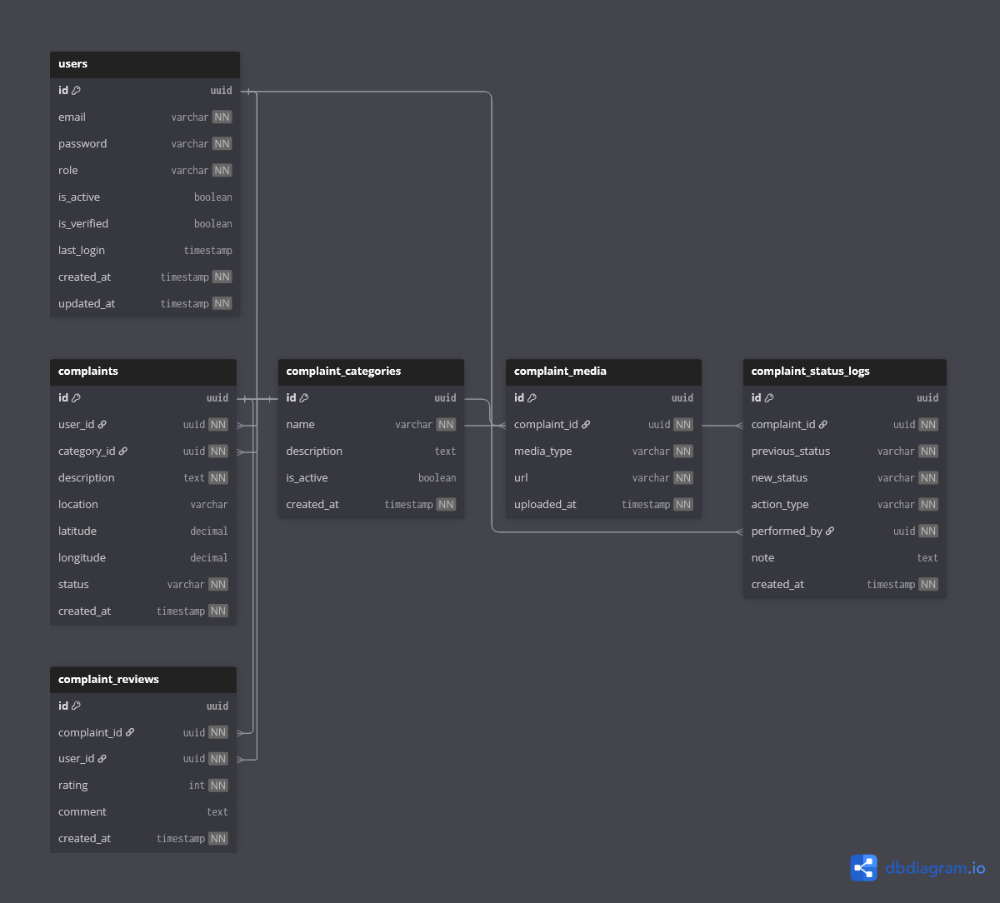

# 🧾 Complaint Context

## Overview

The **Complaint Context** is responsible for handling **citizen-reported civic issues** within the CivicEdge platform.

It enables citizens to formally report problems affecting public infrastructure or services, and allows administrators to review, validate, and track those issues throughout their lifecycle.

This context represents the **official grievance system** of CivicEdge.

In simple terms, this context answers:

> **What problem has been reported by the citizen?**

---

## 🎯 Responsibilities

The Complaint Context handles:

- Complaint submission by citizens
- Categorization of civic issues
- Storage of media evidence (images/videos)
- Complaint lifecycle management
- Status transition tracking
- Administrative review and decision recording
- Citizen feedback after resolution

This context focuses on **problem reporting and tracking**, not execution.

---

All execution-related responsibilities belong to the **Task Resolution Context**.

---

## 🧩 Owned Models

| Table | Description |
|------|-------------|
| `complaints` | Core complaint record submitted by citizens |
| `complaint_categories` | Standardized classification of complaint types |
| `complaint_media` | Image/video evidence uploaded with complaints |
| `complaint_status_logs` | History of complaint status transitions |
| `complaint_reviews` | Citizen feedback after resolution |

---

## 🔗 Relationship Overview

- A complaint is submitted by a **citizen**
- A complaint belongs to **one category**
- A complaint may include **multiple media files**
- Every status change is recorded in **status logs**
- A resolved complaint may receive **one citizen review**
- A verified complaint may generate **one or more tasks**

The complaint itself remains the **single source of truth** for the reported issue.

---

## 🖼️ Context Diagram

> This diagram shows how complaints act as the entry point for civic issue resolution before transitioning into task execution.

---

## 🧠 Design Notes

- Complaints represent **reported problems**, not work.
- Status transitions are logged instead of overwritten to preserve audit history.
- Media is separated to allow multiple attachments without bloating the core table.
- Categories are standardized to enable analytics and structured routing.
- Citizen reviews are stored separately to avoid affecting complaint integrity.

---

