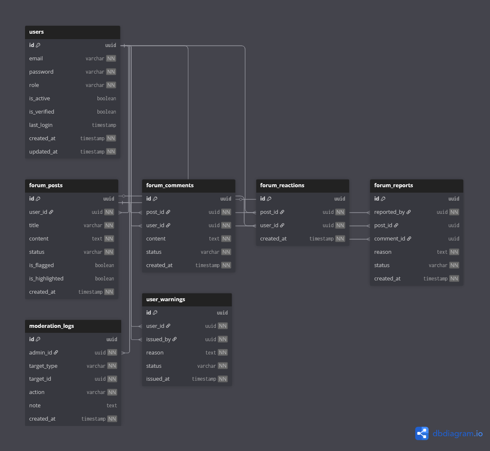

# 💬 Community & Forum Context

## Overview

The **Forum Context** provides a space for citizens to **share ideas, suggestions, concerns, and discussions** related to civic life.

It enables community interaction while maintaining safety through **moderation, reporting, and administrative oversight**.

In simple terms, this context answers:

> **How can citizens communicate and discuss civic topics safely?**

---

## 🎯 Responsibilities

The Forum Context handles:

- Creation and management of community posts
- Commenting and discussion threads
- User reactions (likes)
- Reporting of inappropriate content
- Moderation actions by administrators
- Issuing user warnings for violations

This context focuses on **expression and discussion**, not governance decisions.

---

## 🧩 Owned Models

| Table | Description |
|------|-------------|
| `forum_posts` | Community discussion posts |
| `forum_comments` | Comments under posts |
| `forum_reactions` | User reactions (likes) |
| `forum_reports` | User-submitted content reports |
| `moderation_logs` | Moderator/admin actions |
| `user_warnings` | Behavioral warnings issued to users |

---

## 🔗 Relationship Overview

- A post is created by a user
- Posts may have multiple comments
- Users may react to posts
- Content may be reported by users
- Moderators review reported content
- Moderation actions are logged
- Warnings may be issued for violations

The forum maintains a **moderated but open discussion environment**.

---

## 🖼️ Context Diagram

> This diagram illustrates community interaction flow and moderation oversight within the forum.

---

## 🧠 Design Notes

- Posts and comments support soft deletion to preserve discussion history.
- Reporting is user-driven to encourage community self-regulation.
- Moderation logs ensure transparency of administrative actions.
- Warnings are tracked separately to support escalation policies.
- Forum content is intentionally separated from official civic workflows.

---

