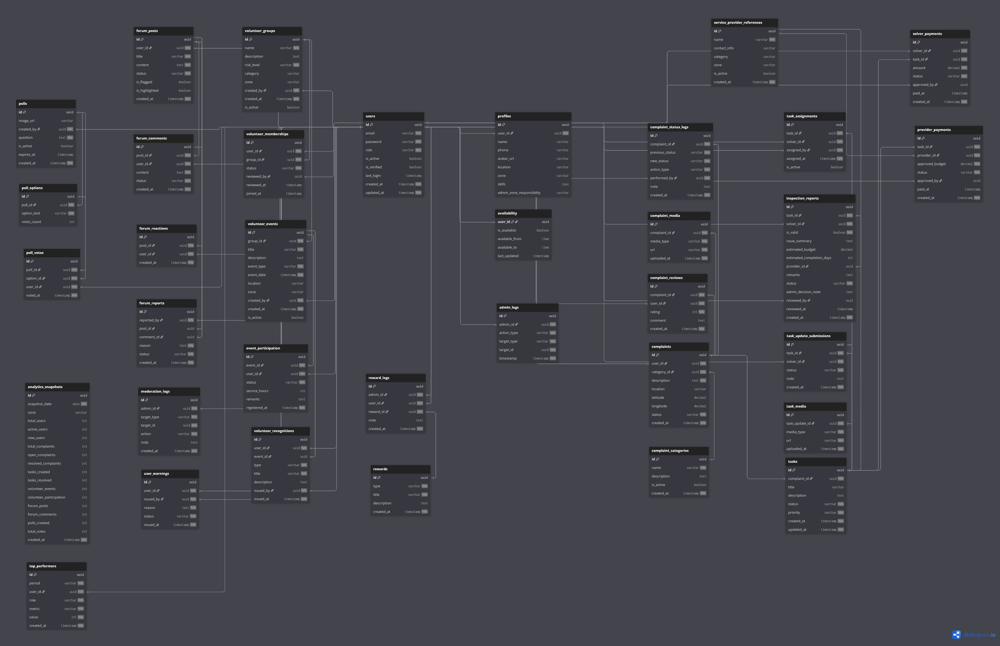

# 🗂️ Database Architecture Overview

## Overview

This section documents the **complete database architecture** of the CivicEdge platform.

The database is designed using a **bounded-context–oriented approach**, where each domain owns its data while sharing a common relational database.

Instead of a single monolithic schema, CivicEdge organizes data around **clear functional responsibilities**, improving maintainability, scalability, and clarity.

---

## 🧠 Design Philosophy

The database architecture follows these core principles:

- **Bounded Contexts** for domain separation
- **Single Source of Truth** per responsibility
- **Clear ownership of tables**
- **Minimal cross-context coupling**
- **Audit-first modeling**
- **Future-safe extensibility**

All tables belong to exactly one context, even though they share the same physical database.

---

## 🗺️ Full Database Diagram

The diagram below represents the **complete logical database structure** of CivicEdge, showing how contexts interact through controlled relationships.

---

## 🧩 Database Context Map

The CivicEdge database is divided into the following bounded contexts:

| Context | Description |
|------|-------------|
| User Context | Identity, roles, profiles, availability, and audit logs |
| Complaint Context | Citizen-reported civic issues and lifecycle tracking |
| Task Resolution Context | Field execution, inspections, and progress updates |
| Provider Context | External service provider references |
| Volunteer Context | Community armies, events, and participation |
| Forum Context | Community discussions and moderation |
| Polling Context | Civic opinion collection and voting |
| Rewards Context | Recognition and appreciation |
| Payments Context | Financial reference tracking |
| Analytics Context | Aggregated insights and system metrics |

Each context is documented independently within this section.

---

## 🔗 Cross-Context Relationships

While contexts are logically isolated, controlled relationships exist:

- Complaints → Tasks  
- Tasks → Payments  
- Tasks → Providers  
- Users → All contexts  
- Analytics ← All contexts (read-only)

No context is allowed to directly modify data owned by another context.

---

## 🧭 Navigation Guide

To explore the database documentation:

1. Start with this overview
2. Choose a context based on functionality
3. Review the context overview
4. Drill down into individual table documentation

This layered approach ensures clarity even as the system grows.

---

## 🔑 Summary

The CivicEdge database architecture balances **real-world civic workflows** with **clean domain boundaries**.

By combining relational consistency with bounded-context thinking, the design remains:

- understandable
- scalable
- auditable
- and future-ready

This structure enables CivicEdge to evolve without requiring disruptive schema redesigns.
