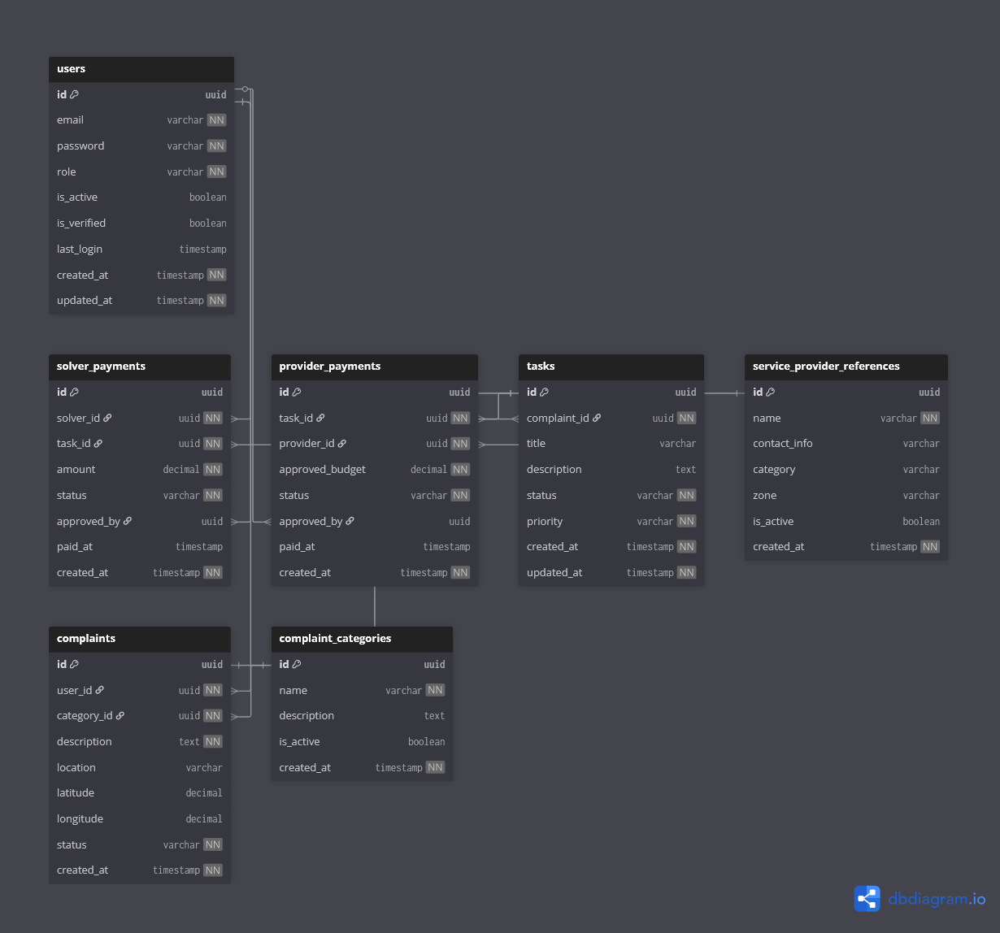

# 💰 Payments & Financial References Context

## Overview

The **Payments Context** is responsible for **recording and tracking financial references** related to civic issue resolution within the CivicEdge platform.

This context does **not process real monetary transactions**.  
Instead, it maintains structured records of payment approvals for transparency, auditing, and administrative tracking.

In simple terms, this context answers:

> **What payments were approved and recorded during civic operations?**

---

## 🎯 Responsibilities

The Payments Context handles:

- Recording solver compensation references
- Tracking service provider budget approvals
- Storing payment status and approval history
- Supporting financial transparency and audits
- Providing data for analytics and reporting

This context focuses on **financial traceability**, not finance execution.

---

## 🧩 Owned Models

| Table | Description |
|------|-------------|
| `solver_payments` | Compensation references for solvers |
| `provider_payments` | Budget payments for external service providers |

---

## 🔗 Relationship Overview

- Solver payments are linked to:
  - one solver
  - one task
- Provider payments are linked to:
  - one task
  - one service provider
- All payment approvals are performed by administrators
- Payment records may be referenced by analytics

This ensures accountability without introducing financial risk.

---

## 🖼️ Context Diagram

> This diagram illustrates how payment references connect to tasks and providers without direct monetary execution.

---

## 🧠 Design Notes

- Payments are recorded as references, not transactions.
- Status-based tracking supports approval workflows.
- Admin approval is mandatory before marking payments as paid.
- Separation between solver payments and provider budgets prevents financial ambiguity.
- This design allows future finance expansion without schema disruption.

---

## 🔄 Payment Flow (Simplified)

### Solver Payment

