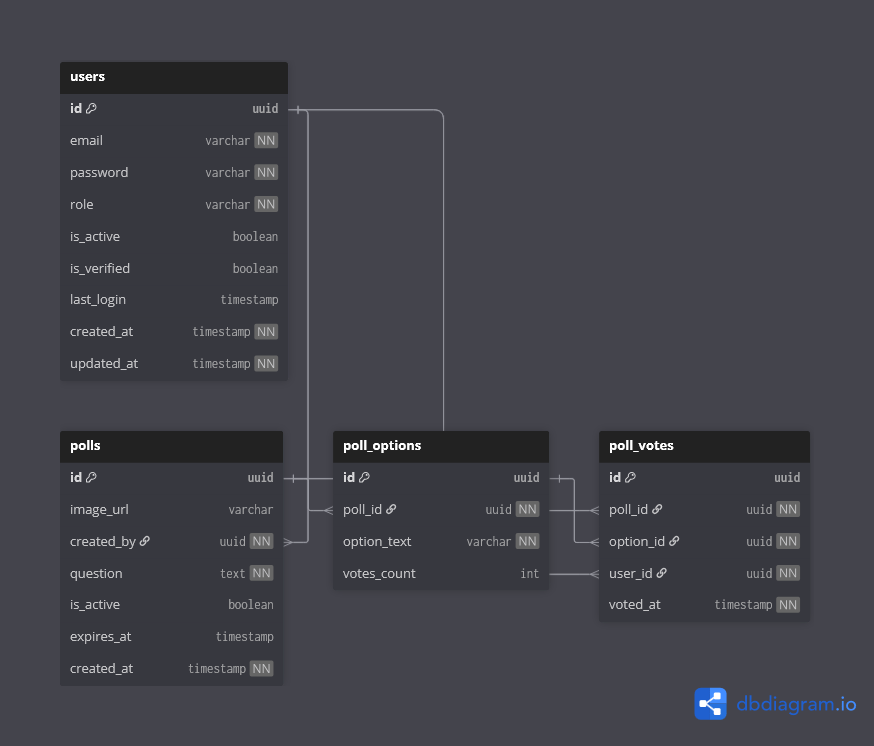

# 🗳️ Polling & Civic Decision Context

## Overview

The **Polling Context** enables administrators to collect **structured public opinion** from citizens on civic topics, proposals, and community decisions.

Unlike forums, which support open discussion, polling provides a **quantifiable and controlled decision mechanism**.

In simple terms, this context answers:

> **What does the community collectively think or prefer?**

---

## 🎯 Responsibilities

The Polling Context handles:

- Creation of civic polls by administrators
- Optional contextual images for clarity
- Definition of poll options
- Secure vote submission by citizens
- Enforcement of one-vote-per-user rules
- Poll expiration and activation control
- Aggregation of voting data for analysis

This context focuses on **decision input**, not execution.

---

## 🧩 Owned Models

| Table | Description |
|------|-------------|
| `polls` | Poll definitions and configuration |
| `poll_options` | Available voting choices |
| `poll_votes` | Individual citizen votes |

---

## 🔗 Relationship Overview

- A poll is created by an administrator
- A poll may contain multiple options
- Citizens may vote once per poll
- Each vote is linked to one option
- Polls may expire or be manually deactivated

This ensures **fair and auditable voting**.

---

## 🖼️ Context Diagram

> This diagram illustrates how polls are created, voted on, and analyzed within CivicEdge.

---

## 🧠 Design Notes

- Voting is restricted to authenticated users.
- Database-level uniqueness ensures one vote per user per poll.
- Optional images provide visual context without affecting voting logic.
- Vote counts may be cached for performance but derived from raw votes.
- Poll results are immutable once the poll expires.

---

