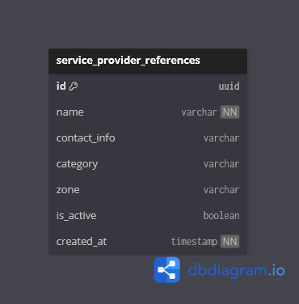

# 🏗️ Service Provider Context

## Overview

The **Service Provider Context** maintains a lightweight registry of **external service providers** that may be involved during civic issue resolution.

This context exists solely to **reference providers during inspections and payments**, without managing full provider lifecycles or contracts.

In simple terms, this context answers:

> **Which external provider is associated with a task or budget?**

---

## 🎯 Responsibilities

The Provider Context handles:

- Storing basic service provider reference information
- Associating providers with inspection reports
- Linking providers to approved budget payments
- Enabling provider-based analytics and audit trails

This context acts as a **reference directory**, not an operational system.

---

## 🚫 Out of Scope

The Provider Context does **not** handle:

- Provider onboarding workflows
- Authentication or login
- Contract management
- Service execution tracking
- Provider performance evaluation
- Billing automation or invoices

Those capabilities may be added in a future expansion but are intentionally excluded in the current version.

---

## 🧩 Owned Models

| Table | Description |
|------|-------------|
| `service_provider_references` | Minimal registry of external service providers |

---

## 🔗 Relationship Overview

- A provider may be referenced by **multiple inspection reports**
- A provider may be linked to **multiple task payments**
- Providers are never assigned tasks directly
- Providers do not interact with the platform as users

This ensures a clean boundary between **internal actors** and **external entities**.

---

## 🖼️ Context Diagram

> This diagram shows service providers as external references connected to task inspections and payments.

---

## 🧠 Design Notes

- Providers are modeled as reference data, not system users.
- Only essential details (name, category, zone, contact) are stored.
- Provider records are created and managed by administrators.
- This design avoids premature complexity while preserving extensibility.

---

## ✅ Design Principles Applied

- Reference-based modeling
- External entity isolation
- Minimal domain surface
- Future-expandable architecture
- Clear ownership boundaries

---

## 🔑 Summary

The Provider Context provides a **clean and minimal abstraction** for associating external service providers with civic resolution workflows.

By keeping providers as references rather than active participants, CivicEdge maintains simplicity while remaining ready for future expansion if deeper provider management becomes necessary.
