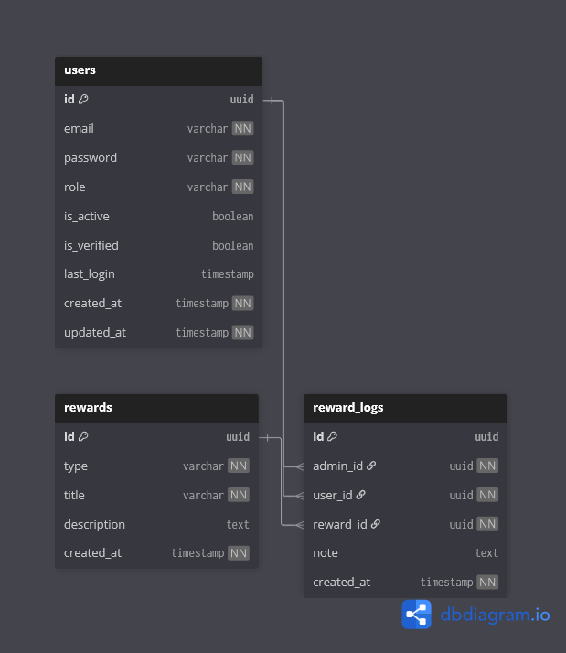

# 🏅 Rewards & Recognition Context

## Overview

The **Rewards Context** is responsible for managing **recognition and appreciation** within the CivicEdge platform.

Its purpose is to acknowledge positive contributions made by citizens, solvers, and volunteers through **badges, certificates, or point-based recognition**.

This context is designed to **encourage engagement**, not to enforce behavior.

In simple terms, this context answers:

> **How does the platform recognize meaningful contributions?**

---

## 🎯 Responsibilities

The Rewards Context handles:

- Definition of reward types
- Issuing rewards by administrators
- Tracking reward history per user
- Maintaining recognition transparency

Rewards are **symbolic acknowledgements**, not monetary compensation.

---

## 🧩 Owned Models

| Table | Description |
|------|-------------|
| `rewards` | Master list of available rewards |
| `reward_logs` | Record of rewards issued to users |

---

## 🔗 Relationship Overview

- Rewards are created and managed by administrators
- A reward may be issued to many users
- A user may receive multiple rewards
- Every reward issuance is recorded for audit purposes

This ensures traceability and transparency.

---

## 🖼️ Context Diagram

> This diagram shows how rewards are defined and issued within CivicEdge.

---

## 🧠 Design Notes

- Rewards are intentionally simple and human-controlled.
- No automated rule engine is used to avoid overengineering.
- Rewards focus on appreciation rather than competition.
- Historical reward logs ensure permanent recognition records.
- This context integrates lightly with analytics for highlighting contributors.

