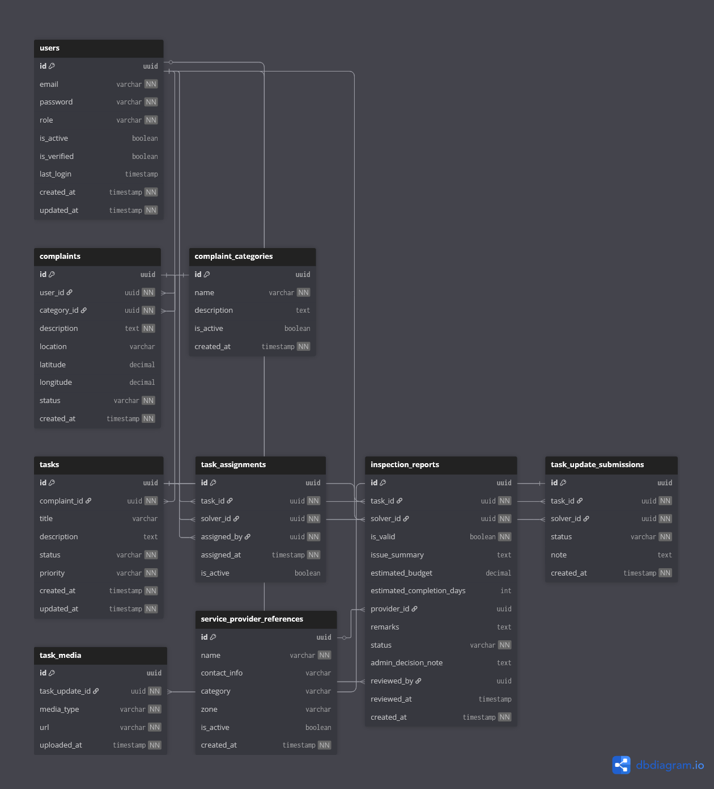

# 🛠️ Task Resolution Context

## Overview

The **Task Resolution Context** is responsible for transforming verified complaints into **actionable field work** and tracking their execution until completion.

This context represents the **operational layer** of CivicEdge — where civic issues move from reports to real-world resolution.

In simple terms, this context answers:

> **How is the reported problem resolved?**

---

## 🎯 Responsibilities

The Task Resolution Context handles:

- Creation of tasks from verified complaints
- Assignment of solvers by administrators
- On-site inspection and validation
- Budget estimation and resolution planning
- Progress updates and field submissions
- Media-based proof of work
- Task lifecycle tracking

This context focuses on **execution**, not reporting.

---

## 🧩 Owned Models

| Table | Description |
|------|-------------|
| `tasks` | Work units created from verified complaints |
| `task_assignments` | Tracks solver assignment history |
| `inspection_reports` | On-site verification and resolution planning |
| `task_update_submissions` | Progress and completion updates by solvers |
| `task_media` | Visual proof uploaded during task updates |

---

## 🔗 Relationship Overview

- A task is created from **one complaint**
- A task may have **multiple solver assignments** (history-based)
- Only one solver is active at a time
- A solver submits **inspection reports**
- A task may receive **multiple progress updates**
- Each update may include **multiple media files**

The task becomes the **execution authority** after complaint approval.

---

## 🖼️ Context Diagram

> This diagram illustrates how complaints transition into tasks and how solvers and administrators collaborate during resolution.

---

## 🧠 Design Notes

- Tasks are created only after administrative review of complaints.
- Assignment history is preserved for audit and reassignment scenarios.
- Inspection reports allow field-level verification before approval.
- Budget estimation is advisory and subject to admin approval.
- Task updates provide continuous progress tracking.
- Media evidence ensures transparency and accountability.

---

