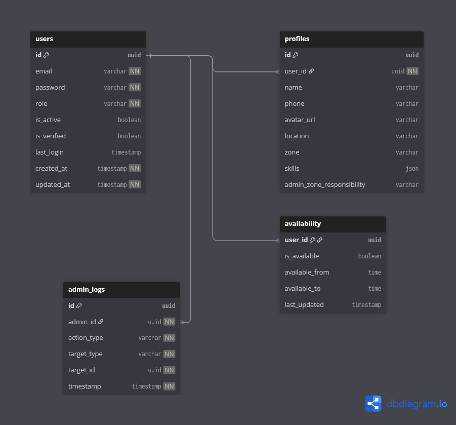

# 👤 User Context

## Overview

The **User Context** is responsible for managing **user identity, roles, profiles, availability, and administrative auditing** within the CivicEdge platform.

This context acts as the **foundation layer** of the system.  
All other contexts — complaints, tasks, volunteering, forums, polling, rewards, payments, and analytics — depend on the users defined here.

In simple terms, this context answers:

> **Who is the user in the system?**

---

## 🎯 Responsibilities

The User Context handles:

- User account identity and authentication metadata
- Role management (`citizen`, `solver`, `admin`)
- Centralized user profile information
- Solver availability scheduling
- Administrative activity auditing
- User moderation records

This context defines **identity**, not **behavior**.

---

## 🧩 Owned Models

| Table | Description |
|------|-------------|
| `users` | Core identity table storing authentication data and role |
| `profiles` | Personal and role-based profile information |
| `availability` | Solver availability configuration |
| `admin_logs` | Audit trail of administrative actions |
| `user_warnings` | Behavioral warnings issued by moderators/admins |

---

## 🔗 Relationship Overview

- Each user has **one profile**
- Solvers may have **availability records**
- Admin actions are tracked using **admin logs**
- Users can receive **warnings** for moderation purposes
- All other contexts reference `users.id` as their identity source

The User Context does not depend on any other domain context.

---

## 🖼️ Context Diagram

> This diagram illustrates the User Context as the root identity provider for all other bounded contexts in CivicEdge.

---

## 🧠 Design Notes

- A **single unified users table** is used instead of separate tables for citizens, solvers, and admins.
- Role-based behavior is enforced at the application level.
- Profile data is separated to keep authentication records minimal and secure.
- Availability is isolated to avoid mixing operational logic with identity.
- Administrative actions are always logged for traceability and accountability.

---

## 🔑 Summary

The User Context forms the **identity backbone of CivicEdge**.

By centralizing identity, roles, availability, and audit tracking, this context enables all other civic workflows to function reliably while maintaining clean separation of responsibilities.
