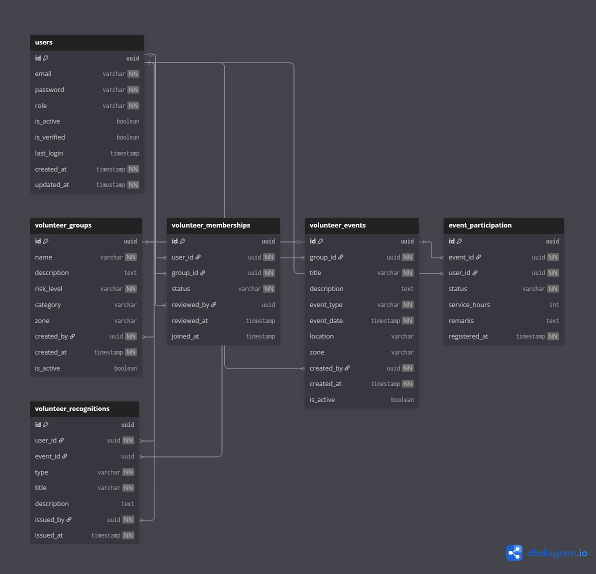

# 🤝 Volunteer & Community Armies Context

## Overview

The **Volunteer Context** enables citizens to actively participate in community service through **organized volunteer armies and events**.

This context transforms civic engagement from passive reporting into **real-world collective action**, allowing citizens to contribute their time, skills, and effort toward social causes.

In simple terms, this context answers:

> **How can citizens voluntarily contribute to their community?**

---

## 🎯 Responsibilities

The Volunteer Context handles:

- Creation and management of volunteer groups (armies)
- Classification of risk and non-risk participation
- Membership applications and approval workflows
- Organization of community and emergency events
- Volunteer participation tracking
- Service hour recording
- Recognition through certificates and badges

This context focuses on **voluntary participation**, not compulsory civic work.

---

## 🧩 Owned Models

| Table | Description |
|------|-------------|
| `volunteer_groups` | Service-based community armies |
| `volunteer_memberships` | Citizen membership and verification |
| `volunteer_events` | Activities and emergency drives |
| `event_participation` | Volunteer registration and attendance |
| `volunteer_recognitions` | Certificates and badges for service |

---

## 🔗 Relationship Overview

- A volunteer group may have **many members**
- Membership may require **approval** based on risk level
- A group can organize **multiple events**
- Citizens may participate in **multiple events**
- Participation may result in **service hours**
- Volunteers may receive **recognition records**

This context maintains a **non-monetary contribution model**.

---

## 🖼️ Context Diagram

> This diagram illustrates how citizens join volunteer armies, participate in events, and receive recognition.

---

## 🧠 Design Notes

- Volunteer groups are categorized as **risk** or **non-risk**.
- Non-risk groups allow direct joining.
- Risk-based groups require administrative verification.
- Events can be normal or emergency-based.
- Participation tracking enables accurate service records.
- Recognition is separated from rewards to preserve volunteer spirit.

---

